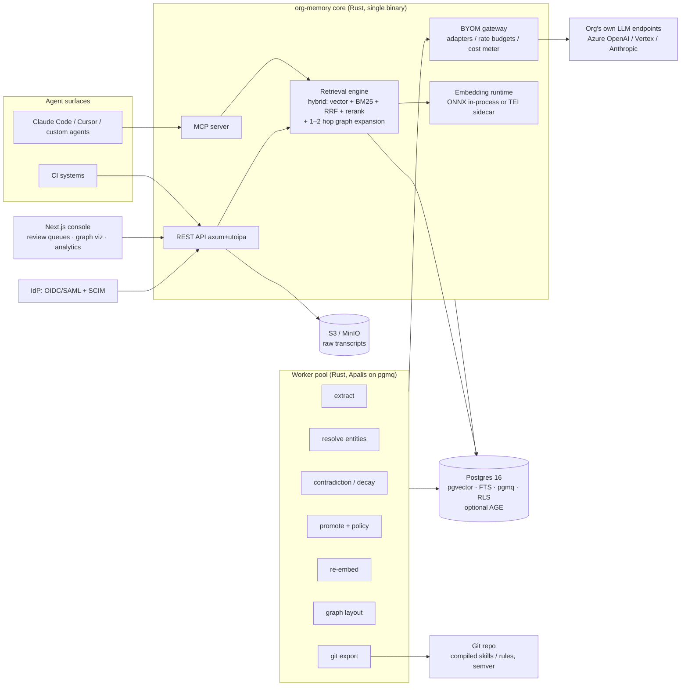

# Org Memory Service — v0 Architecture Sketch

**Positioning:** GitOps for organizational AI knowledge. Capture knowhow from real LLM sessions → provenance → review/promotion pipeline → versioned, permission-aware distribution to agents.

**Stack decisions locked in:**

| Layer | Choice |
|---|---|
| Core service & workers | Rust (axum, single binary) |
| Data plane | Postgres 16+ only (pgvector, FTS, pgmq, optional Apache AGE) |
| Queue | pgmq (Postgres-native); Kafka deferred until proven corporate demand |
| Deployment | Self-hosted first (Helm chart / docker-compose), SaaS later |
| LLM engine | BYOM gateway (Anthropic, Azure OpenAI, Vertex Gemini) |
| Embeddings | Open-source model, benchmarked locally; served via TEI sidecar or in-process ONNX/Candle |
| UI | Next.js governance console; Sigma.js (WebGL) graph rendering |
| Agent interface | MCP server as first-class surface, REST/OpenAPI alongside |
| Identity | OIDC/SAML SSO + SCIM group sync → Postgres RLS |
| Blob storage | S3-compatible (MinIO for self-hosted) for raw transcripts |
| Observability | OpenTelemetry traces + Prometheus metrics; eval harness in CI |

---

## 1. System overview



One deployable unit: the core binary embeds the MCP server, REST API, retrieval engine, BYOM gateway, and (optionally) the embedding runtime. Workers are the same binary started with `--role worker`. Postgres is the only mandatory stateful dependency; MinIO covers transcripts. This keeps the self-hosted story at **two containers + Postgres**.

---

## 2. Data model (schema core)

Conventions: all tables carry `org_id`; RLS policies key off `org_id` + team visibility; timestamps are `timestamptz`; soft-delete via `deleted_at`. Types shown abbreviated.

### 2.1 Identity & tenancy

```sql
CREATE TABLE orgs        (id uuid PK, name text, settings jsonb);
CREATE TABLE teams       (id uuid PK, org_id uuid FK, name text,
                          idp_group_id text,        -- SCIM-synced source of truth
                          UNIQUE (org_id, idp_group_id));
CREATE TABLE users       (id uuid PK, org_id uuid FK, idp_subject text, email text);
CREATE TABLE team_members(team_id uuid FK, user_id uuid FK, role text, PRIMARY KEY(team_id, user_id));
-- role: member | maintainer (maintainers approve promotions for their team)
```

SCIM sync is authoritative for `teams` and `team_members`. Application code never writes membership directly; the SCIM worker reconciles.

### 2.2 Sources & provenance

```sql
CREATE TABLE sources (
  id uuid PK, org_id uuid, team_id uuid,
  kind text,               -- session_transcript | repo | doc | manual
  external_ref text,       -- repo URL, doc URL...
  blob_ref text,           -- s3://bucket/key for raw transcript
  content_hash bytea,      -- integrity / dedup
  created_by uuid,         -- user
  created_at timestamptz
);

CREATE TABLE provenance (
  id uuid PK, org_id uuid,
  actor_kind text,         -- human | agent | pipeline
  actor_id text,           -- user id, agent name, or worker name
  model_ref text,          -- e.g. "azure-openai:gpt-4o:2024-08" when LLM-produced
  source_id uuid FK,       -- originating source
  pipeline_run_id uuid,    -- ties to job for full replay
  created_at timestamptz
);
```

Every memory, entity, and edge points at a `provenance` row. This is the SLSA-style attestation layer: any fact in the graph can be traced to *who/what produced it, from which session, with which model*.

### 2.3 Memories (the knowledge units)

```sql
CREATE TYPE memory_status AS ENUM ('raw','candidate','canonical','deprecated','rejected');
CREATE TYPE visibility    AS ENUM ('private','team','org');

CREATE TABLE memories (
  id uuid PK, org_id uuid, team_id uuid,
  owner_user_id uuid,                 -- for private tier
  visibility visibility DEFAULT 'private',
  status memory_status DEFAULT 'raw',
  kind text,                          -- fact | decision | pattern | pitfall | howto
  content text NOT NULL,              -- distilled natural-language statement
  content_fts tsvector GENERATED ALWAYS AS (to_tsvector('english', content)) STORED,
  lifecycle text DEFAULT 'shipped',   -- shipped | in_flight | proposed (§2.3 below)
  detail_md text,                     -- optional artifact the statement summarizes
  valid_from timestamptz,             -- temporal validity window
  valid_to   timestamptz,             -- NULL = still valid
  superseded_by uuid,                 -- forward pointer on deprecation
  confidence real,                    -- extractor confidence 0..1
  provenance_id uuid FK,
  created_at timestamptz, updated_at timestamptz, deleted_at timestamptz
);

CREATE TABLE memory_embeddings (
  memory_id uuid FK,
  embedding_version_id int FK,
  embedding vector(1024),             -- dim per embedding_versions row
  PRIMARY KEY (memory_id, embedding_version_id)
);

CREATE TABLE embedding_versions (
  id int PK, model_name text, dim int, is_active bool,
  created_at timestamptz
);
```

Design points:

- **Embeddings live in a side table keyed by version.** Model swap = insert new `embedding_versions` row, re-embed worker backfills, flip `is_active`, drop old rows later. Retrieval always filters on the active version. No in-place mutation of the corpus.
- **Temporal validity is first-class** (`valid_from`/`valid_to` + `superseded_by`), enabling "what did we know in March" queries and preventing stale knowhow from poisoning retrieval — deprecated memories are excluded by default but preserved for audit.
- `kind` matters for promotion policy: a `pitfall` ("don't use library X with runtime Y") can have different auto-promotion rules than a `decision`.
- **`lifecycle` separates shipped reality from intent.** Governance status answers *has a human signed this?*; temporal validity answers *when did it hold?*. Neither answers the question a reader of a generated page asks first: *is this how the system works today, or how we plan for it to work?* A decision to adopt Kafka can be canonical, currently valid, and describe nothing that exists in production. Composed pages split on this facet (§8), so the wiki cannot quietly present a roadmap as an architecture. Default `shipped`; the extractor departs from it only when the transcript is explicit.
- **`detail_md` preserves structure the sentence destroys.** `content` stays the distilled claim and remains the *only* retrieval surface (FTS + embeddings point at it, unchanged); `detail_md` optionally carries the literal code block / config / table the claim summarizes. Without it, every composed page is prose-about-artifacts rather than the artifact — the quality ceiling that makes generated docs feel worse than the code they describe. It runs through the same secret-redaction firewall as `content` (a credential is likelier to hide in a code block than in prose).

### 2.4 Graph: entities and edges (collision-tolerant)

```sql
-- Raw, team-scoped nodes. IMMUTABLE — never merged or renamed after creation.
CREATE TABLE entities (
  id uuid PK, org_id uuid, team_id uuid,
  name text, kind text,               -- service | repo | tech | feature | concept | team
  aliases text[],
  provenance_id uuid FK,
  created_at timestamptz
);

-- Org-level canonical entities: the merge targets.
CREATE TABLE canonical_entities (
  id uuid PK, org_id uuid,
  name text, kind text,
  summary text,                       -- LLM-maintained rollup
  created_at timestamptz
);

-- Soft merge: reversible, auditable.
CREATE TABLE entity_links (           -- same_as edges
  entity_id uuid FK, canonical_id uuid FK,
  confidence real,
  method text,                        -- embedding_block | llm_adjudicated | human
  confirmed_by uuid,                  -- user id when human-confirmed
  provenance_id uuid FK,
  PRIMARY KEY (entity_id, canonical_id)
);

CREATE TABLE edges (
  id uuid PK, org_id uuid,
  src_entity uuid FK, dst_entity uuid FK,
  relation text,                      -- uses | depends_on | owns | deprecates | relates_to
  memory_id uuid FK,                  -- evidence: the memory this edge came from
  provenance_id uuid FK,
  valid_from timestamptz, valid_to timestamptz
);

CREATE TABLE memory_entities (        -- memory ↔ entity anchoring
  memory_id uuid FK, entity_id uuid FK, PRIMARY KEY (memory_id, entity_id)
);
```

Design points:

- **Teams/repos are natural starting points**: each team's ingestion creates entities in its own scope. Cross-team collision ("payments API" vs "payment-service") is resolved by linking both to one `canonical_entities` row — the raw nodes are never destroyed. A wrong merge is `DELETE FROM entity_links`, not data surgery.
- **Edges carry evidence** (`memory_id`): every relationship is backed by a retrievable statement, so the graph is explainable in the UI ("why does the graph say team A depends on Kafka? → these 3 memories").
- Traversal at v0: recursive CTEs (1–3 hops is the practical retrieval need). If Cypher ergonomics become worth it, enable **Apache AGE** on the same database — the relational tables remain the source of truth; AGE graph is a projection.

### 2.5 Governance: promotions, contradictions, policy

```sql
CREATE TABLE promotions (
  id uuid PK, org_id uuid,
  memory_id uuid FK,
  from_status memory_status, to_status memory_status,
  policy_decision text,               -- auto_approved | needs_review | denied
  policy_rule text,                   -- which rule fired (audit)
  reviewer_id uuid,                   -- NULL for auto
  reviewed_at timestamptz,
  created_at timestamptz
);

CREATE TABLE contradictions (
  id uuid PK, org_id uuid,
  memory_a uuid FK, memory_b uuid FK,
  detected_by text,                   -- worker/model ref
  status text,                        -- open | resolved_supersede | resolved_coexist | dismissed
  resolution_note text,
  resolved_by uuid, resolved_at timestamptz
);
```

**Policy engine:** [Cedar](https://www.cedarpolicy.com/) — Rust-native, embeds in-process, formally verified evaluator. Policies are data (stored per org, editable in UI), evaluated on every promotion attempt. Example policy intents:

- `kind == pitfall AND confidence > 0.9 AND visibility == team` → auto-promote raw→candidate.
- Anything → `canonical` **always** requires a human maintainer of the owning team.
- Cross-team `canonical` (touching entities linked to ≥2 teams' subgraphs) requires maintainers from each affected team.

(If your org standardizes on OPA later, policies can be dual-evaluated via OPA-wasm — but Cedar keeps the single-binary story.)

### 2.6 Row-level security sketch

```sql
ALTER TABLE memories ENABLE ROW LEVEL SECURITY;

CREATE POLICY memories_read ON memories FOR SELECT USING (
  org_id = current_setting('app.org_id')::uuid
  AND (
    visibility = 'org'
    OR (visibility = 'team' AND team_id IN
        (SELECT team_id FROM team_members
         WHERE user_id = current_setting('app.user_id')::uuid))
    OR (visibility = 'private' AND owner_user_id = current_setting('app.user_id')::uuid)
  )
);
```

The Rust service sets `app.org_id` / `app.user_id` per connection from the verified OIDC token (or MCP session identity). **Similarity search inherits RLS automatically** — the pgvector scan only sees permitted rows. Agents can never retrieve what their operator can't.

---

## 3. Pipeline stages (pgmq jobs)

All workers are the core binary in worker role, consuming pgmq queues via Apalis. Each stage writes a `pipeline_run` record; OTel spans wrap every LLM call with model, tokens, cost, latency.

| # | Queue | Trigger | What it does | LLM? |
|---|---|---|---|---|
| 1 | `ingest` | MCP `memory_add`, transcript upload, connector | Store source blob → S3, create `sources` row, chunk transcript, enqueue extract | no |
| 2 | `extract` | ingest done | BYOM call: distill facts/decisions/pitfalls/howtos + entity mentions + relations from chunk; write `memories(status=raw)`, `entities`, `edges`, provenance | **yes** |
| 3 | `embed` | new/updated memory | Embed content with active model version → `memory_embeddings` | no (local model) |
| 4 | `resolve` | new entity | Blocking: embed entity name+aliases, ANN search over canonical entities; high-sim → BYOM adjudication ("same thing?"); confidence ≥ τ → auto `entity_links`, else → human review queue | **yes** (adjudication only) |
| 5 | `contradict` | new candidate/canonical memory | ANN + entity-overlap search for semantically close memories with conflicting claims; BYOM verdict; open `contradictions` row; suggested resolution: supersede (set `valid_to`, `superseded_by`) | **yes** |
| 6 | `promote` | schedule + on-demand | Evaluate Cedar policies over raw/candidate memories; auto-promote or push to review queue; write `promotions` audit row | no |
| 7 | `export` | canonical set changed | Compile canonical memories per domain into versioned artifacts (SKILL.md / rules files), semver bump, commit+push to org Git repo | optional (formatting) |
| 8 | `reembed` | admin: model swap | Backfill `memory_embeddings` for new version in batches; flip active when complete | no |
| 9 | `layout` | graph mutation batch | Recompute force-directed layout server-side (Rust), persist x/y per node for UI | no |
| 10 | `scim_sync` | schedule/webhook | Reconcile teams/members from IdP | no |

**Rate budgeting:** the BYOM gateway owns a per-org, per-provider token bucket. Workers request capacity before calling; on 429/exhaustion, jobs re-queue with backoff. Cost accounting increments per `(org, provider, pipeline_stage)` — surfaced in the UI so an org sees exactly what its own LLM endpoints spend on memory management.

---

## 4. Retrieval engine (the Rust hot path)

Request flow for `memory_search` / context assembly:

1. **Query understanding** (cheap, local): normalize, detect exact identifiers (repo names, error codes).
2. **Parallel candidates:**
   - pgvector ANN (active embedding version, RLS-scoped), top 50
   - Postgres FTS / BM25, top 50
3. **Fusion:** reciprocal rank fusion → top 30.
4. **Graph expansion:** anchor entities of top hits → 1–2 hop neighbors via recursive CTE → pull their strongest memories (bounded, e.g. +10). This is where cross-team knowledge surfaces: your query about "payments retries" walks through the canonical *payments* entity into another team's pitfalls.
5. **Rerank:** cross-encoder (local ONNX) over ≤40 candidates → top k.
6. **Assembly:** dedupe superseded chains, order by relevance + recency, attach provenance refs, emit with token budget.

Latency budget target: p95 < 150 ms without rerank, < 400 ms with rerank, on modest self-hosted hardware. (Embedding + rerank in-process via ONNX/Candle keeps this achievable without GPU.)

---

## 5. API surfaces

### 5.1 MCP tools (the product interface for agents)

| Tool | Purpose |
|---|---|
| `memory_search(query, k, scope?)` | Hybrid retrieval as above; returns memories + provenance + entity anchors |
| `memory_context(task_hint)` | Session-start bundle: relevant canonical knowledge for the repo/team/task, token-budgeted |
| `memory_add(content, kind, entities?)` | Write a raw memory (enters pipeline) |
| `knowledge_propose(memory_id)` | Nominate own/team memory for promotion |
| `entity_lookup(name)` | Resolve name → canonical entity + subgraph summary |
| `memory_feedback(memory_id, signal)` | useful / stale / wrong — feeds decay & analytics |

MCP identity: each developer's agent authenticates with a personal token mapped to their user → RLS applies transparently. `memory_context` is the wedge feature: *one call at session start and the agent knows what the org knows.*

### 5.2 REST (UI + CI)

- `GET/POST /v1/memories`, `/v1/entities`, `/v1/graph` (viewport-windowed, precomputed layout)
- `GET /v1/reviews/promotions`, `/v1/reviews/contradictions`, `/v1/reviews/entity-links` + approve/reject actions
- `POST /v1/admin/byom` (provider config, vault-referenced credentials), `/v1/admin/embedding-versions`, `/v1/admin/policies` (Cedar)
- `GET /v1/analytics` (retrieval hit rates, memory usage, cost per stage, knowledge coverage per team)
- OpenAPI generated from code (utoipa); TypeScript client generated for Next.

### 5.3 Next.js console — three jobs only (v0)

1. **Review queues** — promotions, contradictions, low-confidence entity merges. This is where governance lives; make it as fast as a code review.
2. **Graph explorer** — Sigma.js WebGL, server-precomputed layout, team-colored subgraphs, canonical entities as hubs; click an edge → the evidence memories.
3. **Admin & analytics** — BYOM config, policies, SSO/SCIM status, cost + usage dashboards.

---

## 6. Deployment (self-hosted first)

```
helm install org-memory ./chart
  ├─ core        (Deployment, N replicas: MCP + REST + retrieval, stateless)
  ├─ worker      (Deployment, M replicas: same image, --role worker)
  ├─ ui          (Next.js standalone)
  ├─ postgres    (bring-your-own recommended; bundled Bitnami PG for eval installs)
  └─ minio       (optional; or org's S3)
```

- **Secrets:** BYOM API keys and DB creds via Kubernetes secrets backed by the org's Vault/KMS (ExternalSecrets pattern). Keys never in Postgres; only vault references.
- **Egress posture:** the only outbound calls are to the org's own LLM endpoints, IdP, and their Git remote. No telemetry phone-home by default (sales asset for this buyer). OTel exports to *their* collector.
- **docker-compose** profile for laptop eval — the "15-minute trial" path matters for bottom-up adoption.
- **Migrations:** sqlx migrate, run as init job, additive-only policy between minor versions.

---

## 7. Evaluation & observability (CI-gated)

- **Golden fixture suite:** synthetic org (3 teams, overlapping entities, planted contradictions, temporal supersessions). CI runs full pipeline + retrieval and scores: extraction precision/recall, entity-merge accuracy, contradiction detection, retrieval NDCG@k, temporal correctness ("answer as of date X").
- **Regression gates:** prompt or model changes must not drop scores > ε. Embedding benchmark harness reuses the same fixtures — your local open-model bake-off produces comparable numbers (candidates worth including: bge-m3, gte-large / gte-Qwen variants, nomic-embed, jina-embeddings-v3; plus bge-reranker for stage 5).
- **Runtime:** OTel traces end-to-end (MCP call → retrieval → SQL → rerank), Prometheus metrics: retrieval latency histograms, queue depth per pgmq queue, BYOM tokens/cost per stage, review-queue age (governance SLO: median promotion review < 48 h or the flywheel dies).

---

## 8. Document layer — auto-managed wiki pages (agent-first, human-readable)

**Design principle: pages are projections, not a second source of truth.** Canonical memories remain the single governed knowledge substrate; a document is a *compiled view* over them, regenerated when its underlying memories change. This is what makes the wiki immune to rot — the classic failure of every Confluence — and it reuses the entire existing governance machinery (Cedar policies, review queues, provenance) instead of duplicating it.

### 8.1 Page model

A document is a sequence of sections; each section is either **composed** (bound to a memory query, machine-regenerated) or **pinned** (human-authored prose, never touched by regeneration):

```sql
CREATE TABLE documents (
  id uuid PK, org_id uuid, team_id uuid,
  slug text UNIQUE, title text,
  visibility visibility,              -- reuses the three-tier model
  doc_kind text,                      -- entity_page | topic_page | runbook | onboarding
  status text,                        -- draft | published | archived
  current_revision uuid,
  created_at timestamptz, updated_at timestamptz
);

CREATE TABLE document_sections (
  id uuid PK, document_id uuid FK, position int,
  heading text,
  mode text,                          -- composed | pinned
  binding jsonb,                      -- composed: {entities:[...], kinds:[...], query:"...", max_items:N}
  pinned_content text                 -- pinned: preserved verbatim across regenerations
);

CREATE TABLE document_revisions (
  id uuid PK, document_id uuid FK,
  content_md text,                    -- fully rendered markdown
  composed_from jsonb,                -- exact memory ids + versions used (provenance closure)
  trigger text,                       -- memory_change | manual | schedule
  policy_decision text,               -- auto_published | needs_review
  reviewed_by uuid, published_at timestamptz,
  created_at timestamptz
);

CREATE TABLE document_dependencies (  -- inverted index: which pages a memory feeds
  document_id uuid FK, memory_id uuid FK,
  PRIMARY KEY (document_id, memory_id)
);
```

### 8.2 Composition pipeline (new pgmq queue: `compose`)

| Step | Behavior |
|---|---|
| Dirty marking | Canonical memory inserted / superseded / deprecated → look up `document_dependencies` → mark dependent pages dirty. Contradiction resolutions therefore **propagate automatically to every page** citing the losing memory. |
| Compose | For each composed section: run its binding through the retrieval engine (canonical-only, visibility-capped), BYOM writes section prose **citing memory ids inline** (`[m:uuid]` annotations, rendered as footnotes for humans, structured refs for agents). Pinned sections pass through untouched. |
| Diff & policy | New revision diffed against current. Cedar decides: small additive diff + all claims traceable → `auto_published`; structural change / deletion of previously published claims → review queue (same UI as promotions). |
| Health gate | Before any *external* publish, the Knowledge Health composite (§7 / `/v1/analytics/knowledge-health`) is consulted: if the **currency** or **governance** pillar is below threshold, the sync pauses and the page holds its last published revision with a "verification pending" stamp. An auto-published wiki is an amplifier; without this gate a stalled review queue would broadcast stale beliefs to the whole company at machine speed — the exact failure the UAT runs found (the backlog kept being served as truth and nothing went red). The circuit breaker is what turns the health score from a report into an actuator. |
| Publish | Revision becomes current and is handed to the **`Publisher`** targets configured for the org (see §8.5). |

**Visibility capping (leak prevention):** composition of an `org`-visible page runs retrieval as a synthetic principal with only org-tier access — team-private memories physically cannot enter the page, enforced by the same RLS path as user queries. This must be a hard invariant, verified by the eval harness (see fixture design).

### 8.3 Human edits flow back through the pipeline

Humans can edit pages in the UI, but edits do not fork the truth:

- Edits inside **pinned** sections: saved directly (they're owned prose).
- Edits inside **composed** sections: the diff is sent through the **extraction pipeline** — proposed memory updates/additions enter the normal promote flow, and the section regenerates once they land. The editor sees "your change was captured as 2 proposed knowledge updates" rather than a silently diverging page. A human editing the wiki is just another ingestion source.

### 8.4 Surface additions

- **MCP:** `doc_get(slug, as_of?)` — markdown with provenance refs, optionally time-traveled via revision history; `doc_search(query)` — page-level retrieval; `memory_context` may now include excerpts of the most relevant pages for the task.
- **REST/UI:** page reader (rendered revisions, per-claim provenance popovers), page editor with pinned/composed section awareness, revision diff review queue.
- **Page bootstrapping:** an `entity_page` can be auto-scaffolded for any canonical entity above an activity threshold (e.g. referenced by ≥ N canonical memories across ≥ 2 teams) — the wiki grows where the knowledge actually is, instead of where someone remembered to create a page.

### 8.5 Publishing: the KB is a projection, and so is the wiki you already have

Publishing is a **`Publisher` trait** with pluggable targets — Git (`docs/`, semver, alongside compiled skills), **Confluence** (PAT), and later Notion / Backstage. The strategic point of the Confluence target is that a team does not have to abandon its wiki to stop it rotting: Brainiac keeps the pages they already read honest, and Confluence becomes a render surface rather than a competing source of truth.

Hard invariants on every external target:

- **One-way.** Pages are pushed, never pulled. A published page carries a generated-content banner and provenance links back to the console. Direct edits in the external tool are overwritten on the next compose — harvesting them back as an ingestion source is a later increment, not a promise we make on day one. Bidirectional sync would recreate exactly the two-sources-of-truth problem §8 exists to eliminate.
- **`org`-visibility only (v1).** External publish leaves RLS behind entirely, so only `org`-visible canonical memories may compose into a synced page; team and private knowledge renders in the console only. Per-team space mapping comes after the leak eval covers the mapping matrix. A leaked private memory in a company wiki is not a score deduction — it is an unrecoverable trust event.
- **Health-gated** (§8.2) — a degraded corpus stops publishing rather than broadcasting.

**Scoping (optional but recommended).** The document layer is an org capability flag, and API tokens carry KB scopes (`kb:read`, `kb:compose`, `kb:publish`) alongside their memory scopes. A single-team org that wants only the memory layer never pays for the KB layer, and an agent's token can read pages without ever being able to publish one. Agents write *memories*; pages follow from them.

---

## 9. v0 → v1 cut line

**In v0:** memories + entities/links + hybrid retrieval + extract/resolve/promote pipeline + MCP surface + review UI + Helm chart + eval harness.

**v0.5 — IN PROGRESS (see `docs/KB-PLAN.md` for the phase ladder):** document layer (§8) — it reuses retrieval, policy, review, and export machinery, so it lands cheaply once the core is proven; entity-page auto-scaffolding last. KB0 (the memory facets §2.3 depends on, plus the Knowledge Health surface the publish gate reads) is done; KB1–KB4 build the page model, read surfaces, publishing, and the human-edit round trip. External publishing does not ship to a real org until the extraction-recall gate is green — composed pages inherit the trustworthiness of their substrate.

**Deliberately deferred:** Kafka (pgmq until corporate scale proves it), Apache AGE (recursive CTEs first), connectors beyond transcript upload + one Git connector, SaaS multi-tenancy hardening, fine-grained per-memory ACLs beyond the three-tier visibility, automated decay scoring (start with manual `memory_feedback` signals).

**Known risks to watch:**
1. Extraction quality variance across BYOM providers → the eval harness must run per-provider; publish a support matrix.
2. Review-queue neglect (the behavioral risk from our earlier discussion) → analytics must expose it; consider Slack/Teams notification worker early.
3. Entity-resolution precision on sparse early data → bias thresholds toward human review at first; loosen with data.
